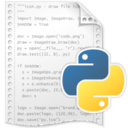

import statusBarLight from "./images/idle-status-bar-light.png";
import statusBarDark from "./images/idle-status-bar-dark.png";
import apiKeyDialogLight from "./images/idle-api-key-dialog-light.png";
import apiKeyDialogDark from "./images/idle-api-key-dialog-dark.png";
import optionsMenuLight from "./images/idle-options-menu-light.png";
import optionsMenuDark from "./images/idle-options-menu-dark.png";



Follow these steps to start tracking your coding time in Python's IDLE with Hackatime. The plugin works on macOS and Linux.

## Step 1: Log into Hackatime

Make sure you have a [Hackatime account](https://hackatime.hackclub.com) and are logged in.

## Step 2: Run the setup script

Visit the [setup page](https://hackatime.hackclub.com/setup) to automatically configure your API key and endpoint. This ensures everything works perfectly with Hackatime.

## Step 3: Install the IDLE plugin

Run these commands in a terminal, using the same `python3` that you open IDLE with:

```sh
curl -fsSLO https://raw.githubusercontent.com/hackclub/idle-hackatime/main/IdleHackatime.py
python3 IdleHackatime.py install
```

The installer adds the plugin to IDLE and downloads wakatime-cli if you don't have it yet. If you skipped Step 2, it asks for your API key.

## Step 4: Restart IDLE

Close every IDLE window and open IDLE again. The Hackatime logo and today's coding time appear in the bottom-left corner of each editor window.


If you haven't set an API key yet, IDLE asks for one when it opens. Paste the key from your [Hackatime settings](https://hackatime.hackclub.com/my/settings) and press **OK**.


You can change your API key at any time from **Options → Hackatime API Key...**. **Options → Hackatime Dashboard** opens your dashboard in the browser.


## What gets tracked

IDLE sends a heartbeat when you open or switch to a file, while you edit it and every time you save. Your project, branch, language, line and cursor position come along with it. Files you haven't saved yet and the IDLE Shell window aren't tracked.

## Troubleshooting

- **Not seeing your time?** Make sure you completed the [setup page](https://hackatime.hackclub.com/setup) first. Heartbeats can take up to two minutes to show up.
- **No logo in the status bar?** The plugin was installed for a different Python. Run `python3 -m idlelib` to open IDLE with the same Python you installed it with.
- **macOS with Homebrew?** IDLE needs Tk, so install it with `brew install python-tk` first.
- **Something else?** Check `~/.wakatime/idle-hackatime.log` for errors.
- **Still stuck?** Ask for help in [Hack Club Slack](https://hackclub.slack.com) (#hackatime-help channel).

To remove the plugin, run `python3 IdleHackatime.py uninstall`.

## Next steps

Once configured, your coding time will automatically appear on your [Hackatime dashboard](https://hackatime.hackclub.com). Happy coding!
