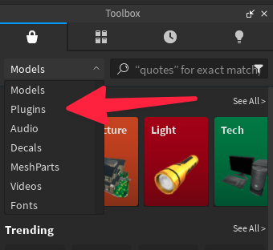
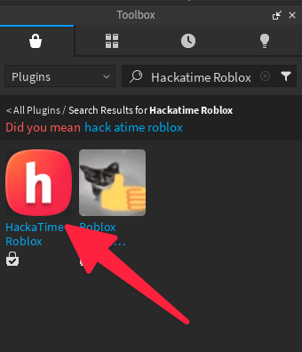
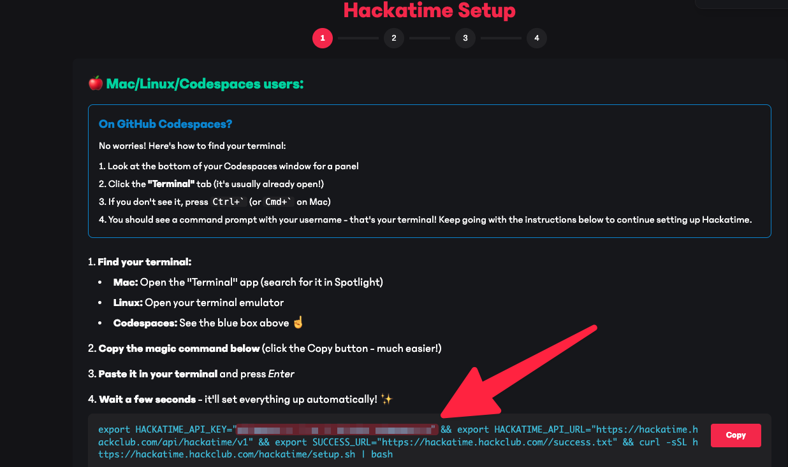
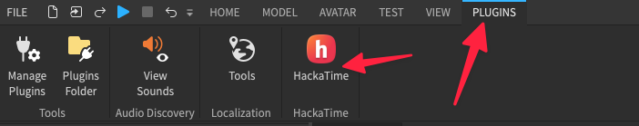
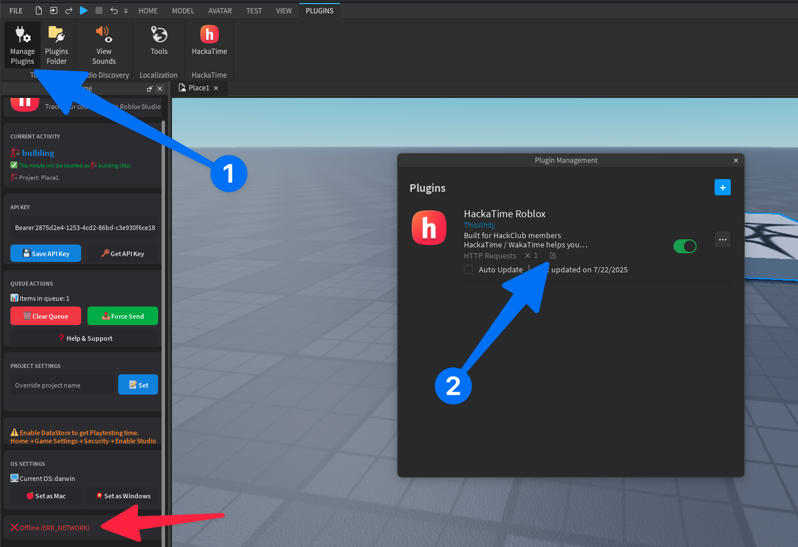
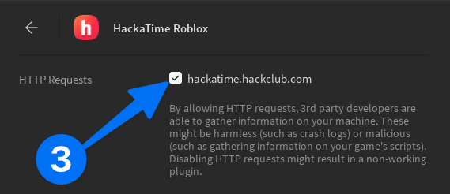

This guide will walk you through setting up **Hackatime** to automatically track your game development time in **Roblox Studio**.

---

## Step 1: Log in to your Hackatime account

First, make sure you have a **Hackatime account** and are logged in. If you don't have an account, you can create one at [hackatime.hackclub.com](https://hackatime.hackclub.com).

---

## Step 2: Install the Hackatime Roblox Studio plugin

Next, you'll need to install the Hackatime plugin directly within Roblox Studio:

1.  Open **Roblox Studio**.
2.  Navigate to the **Toolbox**.
3.  In the Toolbox search bar, select **"Plugins"** from the dropdown filter.
4.  Search for **"HackaTime Roblox"**.
5.  Install the plugin published by **"ThisWhity"**.

    
    *Filter the Toolbox by "Plugins"*

    
    *Install the "HackaTime Roblox" plugin by ThisWhity*

---

## Step 3: Configure the plugin with your API key

Now, you'll connect the plugin to your Hackatime account using your unique API key:

1.  Get your API key by visiting [hackatime.hackclub.com/my/wakatime_setup](https://hackatime.hackclub.com/setup). It will look something like this: `xxxxxxxx-xxxx-xxxx-xxxx-xxxxxxxxxxxx`.

    
    *Your API key from the Hackatime website*

2.  In Roblox Studio, open the **Hackatime plugin**. You'll usually find it under the "Plugins" tab in the Ribbon bar.

    
    *Open the Plugin*

4.  Paste your API key into the API key box. And hit "Save API Key"

---

## Troubleshooting

### ERR\_NETWORK: Plugin cannot connect to Hackatime

If you see an **ERR\_NETWORK** message, it means the plugin can't connect to Hackatime. This is likely due to you not allowing HTTP request from the plugin:

1.  Open the "Manage Plugins".
2.  Hit the edit icon.
3.  Ensure that **"hackatime.hackclub.com"** is enabled.

    
    *Open Plugin Managment*

    
    *Allow HTTP requests*

### Still stuck?

If you're still experiencing issues, don't hesitate to ask for help in the **#hackatime-help channel** on the [Hack Club Slack](https://hackclub.slack.com).

---

## What's next?

Once the plugin is successfully configured, your Roblox Studio activity time will automatically start appearing on your [Hackatime dashboard](https://hackatime.hackclub.com).

Happy game developing!
