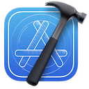
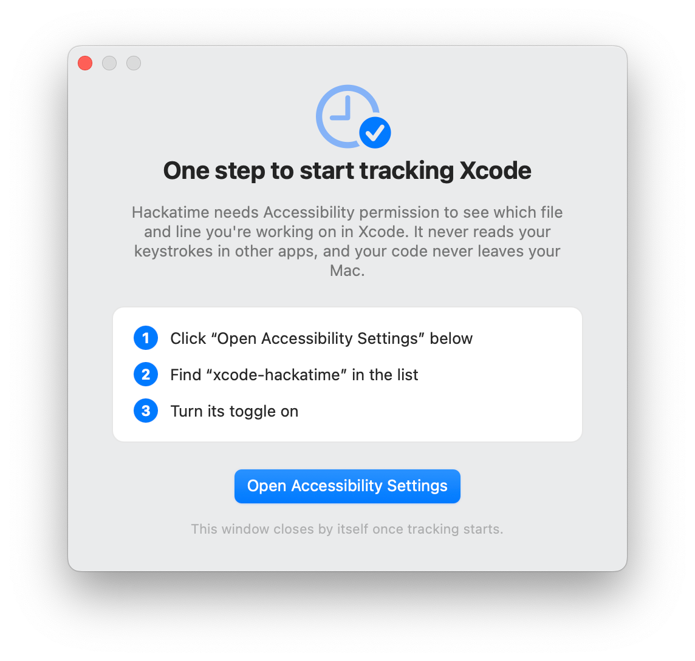

Follow these steps to start tracking your coding time in Xcode with Hackatime.

## Step 1: Log into Hackatime

Make sure you have a [Hackatime account](https://hackatime.hackclub.com) and are logged in.

## Step 2: Run the setup script

Visit the [setup page](https://hackatime.hackclub.com/setup) to automatically configure your API key and endpoint. This ensures everything works perfectly with Hackatime.

## Step 3: Install the Xcode plugin

Run this command in your terminal to install the Hack Club xcode-hackatime plugin:

```bash
curl -fsSL https://raw.githubusercontent.com/hackclub/xcode-hackatime/main/install.sh | bash
```

This installs `xcode-hackatime`, a background agent that tracks your Xcode coding time (file, line, cursor position, and saves) using your Hackatime config from the setup script. It's super lightweight and uses ~6MB of RAM, so you don't have to worry about battery/RAM usage!

## Step 4: Grant Accessibility permission

To track things like what line you're on, we use macOS's Accessibility APIs!

This means that macOS will ask you to allow xcode-hackatime to use them: **System Settings -> Privacy & Security -> Accessibility -> enable `xcode-hackatime`**. You'll probably see a window like this to help you through it:



That's it - the agent starts at login and follows Xcode automatically!

## Troubleshooting

<Accordion>
  <AccordionItem title="Not seeing your time?">
    Make sure you completed the [setup page](https://hackatime.hackclub.com/setup) first.
  </AccordionItem>
  <AccordionItem title="Something not working?">
    Run `~/.wakatime/xcode-hackatime doctor` - it checks every part of the tracking chain and prints a fix for anything broken.
  </AccordionItem>
  <AccordionItem title="Previously used the WakaTime Mac app?">
    xcode-hackatime turns off its Xcode tracking automatically so your time is not double-counted (you'll get a notification when that happens).
  </AccordionItem>
  <AccordionItem title="Still stuck?">
    Ask for help in [Hack Club Slack](https://hackclub.slack.com) (#hackatime-help channel).
  </AccordionItem>
</Accordion>

## Next steps

Once configured, your coding time will automatically appear on your [Hackatime dashboard](https://hackatime.hackclub.com). Happy coding!
