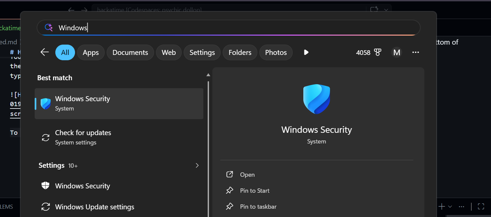
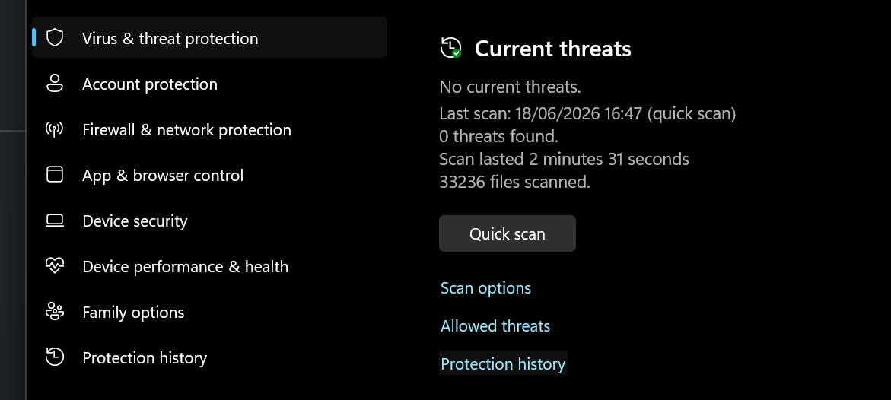

If the Hackatime VS Code extension is stuck on "Initialising" on Windows, your antivirus or Windows Security may be quarantining the Wakatime executable.

## The fix?

Making sure that your security / antivirus software isn't quarantining hackatime!

You'll know you have this error if you see this in the bottom of your VS Code. Even after you start typing some code!

To double check this is the issue go to your `.wakatime` folder. (`CTRL - R`, enter `%USERPROFILE%` and it should be there)

If this wakatime folder doesn't contain a `.exe` you have this issue.

To fix this go to **Windows Security**:
Start -> **Windows Security**.

Then go to **Virus and Threat Protection** and click on **Protection History**.

Once you're in there try to look for an application called `wakatime`, and then try to create an "Exclusion" for it, using the three dots.
